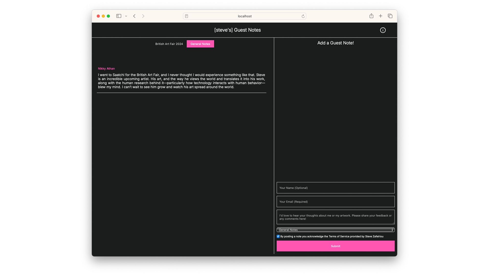
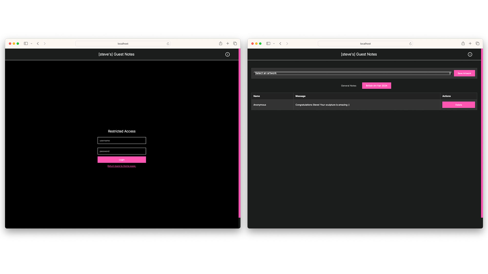

# Guest Notes App for Art Exhibitions



## Overview

The **Guest Notes App** is a React.js web application built for art exhibitions and events. Visitors can leave feedback, comments, or thoughts about artwork or the event itself. The app features real-time note submission, an admin dashboard, artwork information display, and interactive elements like confetti and toast notifications. The app also allows URL-based navigation, enabling direct access to specific exhibitions (tags) via query parameters.

_For faster implementation, the app uses WordPress posts to manage the "current exhibited" artwork information. However, you can easily customize the database setup to fit your needs—whether it's SQL, Firebase, MongoDB, or any other database. For the purposes of this documentation, we assume an SQL-based setup and provide SQL examples accordingly._

## Features

- **Live Guest Notes Display**: New notes appear instantly at the top of the list.
- **Tag-Based Filtering**: Users can view guest notes for a specific exhibition or event by selecting a tag. The selected tag is reflected in the URL as a query parameter (e.g., `?tag=2`).
- **Artwork Info Display**: Each exhibition can have an associated artwork post retrieved from a WordPress blog via a REST API. This post is shown in the app's popup window.
- **Interactive Hover Effects**: Hovering over a note blurs other notes to focus on the selected one.
- **Cursor-Following Text**: Hovering over elements triggers a small text to follow the mouse cursor.
- **Form Validation**: Guests must provide an email address and accept the terms of service before submitting feedback.
- **Confetti Animation**: A confetti animation is triggered upon successful submission of a note.
- **Toast Notifications**: Progress and success/error notifications are displayed during the note submission process.
- **Admin Dashboard**: Admins can log in to refresh the page, log out, and select artwork for specific exhibitions.
- **Dynamic Content Control**: Admins can manage which artwork is displayed in the popup through a WordPress REST API, enabling easy updates from the WordPress dashboard.
- **Tag Synchronization**: The tag dropdown in the feedback form is synchronized with the currently selected exhibition tab.

## Technologies Used

- **Frontend**:

  - React.js
  - Styled-components for CSS-in-JS
  - React-toastify for notifications
  - React-confetti for animations
  - React Router for routing

- **Backend**:
  - WordPress REST API for artwork posts
  - MySQL for storing guest notes
  - A custom REST API for note submission and retrieval

## Prerequisites

Before running this application, make sure you have the following installed:

- **Node.js** (v12.x or higher)
- **npm** (Node package manager)

_If you follow this documentation, you will also need a WordPress blog for managing artwork posts and a backend API to handle guest notes._

### Required Database Structure

To store the guest notes, your database should have the following structure (using MySQL as an example):

```sql
CREATE TABLE guest_notes (
  id INT AUTO_INCREMENT PRIMARY KEY,
  name VARCHAR(255) DEFAULT NULL,
  email VARCHAR(255) NOT NULL,
  message TEXT NOT NULL,
  tag_id INT NOT NULL,  -- Connects the note to an exhibition (tag)
  created_at TIMESTAMP DEFAULT CURRENT_TIMESTAMP
);

CREATE TABLE guest_notes_tags (
  id INT AUTO_INCREMENT PRIMARY KEY,
  tag_name VARCHAR(255) NOT NULL,
  created_at TIMESTAMP DEFAULT CURRENT_TIMESTAMP
);

CREATE TABLE guest_notes_cur_artwork (
  post_id INT NOT NULL,  -- Stores the current selected artwork post ID
  created_at TIMESTAMP DEFAULT CURRENT_TIMESTAMP
);
```

### Database Fields:

- **`guest_notes`** table:

  - **`id`**: Auto-incremented ID for each note.
  - **`name`**: Name of the guest (optional).
  - **`email`**: Email of the guest (required).
  - **`message`**: The feedback message (required).
  - **`tag_id`**: Reference to the exhibition or event (required).
  - **`created_at`**: Timestamp of when the note was created.

- **`guest_notes_tags`** table:

  - **`id`**: Auto-incremented ID for each tag.
  - **`tag_name`**: Name of the exhibition or event.
  - **`created_at`**: Timestamp of when the tag was created.

- **`sz_guest_notes_cur_artwork`** table:
  - **`post_id`**: The WordPress post ID of the selected artwork to be displayed for the exhibition.
  - **`created_at`**: Timestamp of when the artwork selection was made.


## Installation

Follow these steps to set up and run the Guest Notes App locally:

### 1. Clone the Repository

```bash
git clone https://github.com/saphirelabs/guest-notes-app.git
cd guest-notes-app
```

### 2. Install Dependencies

```bash
npm install
```

### 3. Set Up Environment Variables

Create a `.env` file in the root of your project and add the following:

```bash
REACT_APP_API_URL=https://your-backend-api.com
```

Replace `https://your-backend-api.com` with the URL of your backend API that handles guest notes and artwork retrieval.

### 4. Run the Application

Once everything is set up, start the development server:

```bash
npm start
```

The app will be running at `http://localhost:3000`.



## Usage

### Submitting Guest Notes

Guests can:

1. Enter their name (optional), email (required), and a feedback message.
2. Check the "Accept Terms of Service" box.
3. Submit the note, which will appear instantly in the guest notes section at the top of the page.

### Artwork Popup

- Admins can select an artwork via the dashboard, which will be displayed in the popup.
- The popup has two tabs:
  - **Artist Info**: Displays a QR code for the artwork.
  - **Artwork Info**: Shows the selected artwork's title, image, and content retrieved via the WordPress REST API (in this case - adjust it based on your database).

### Admin Dashboard

Admins can:

- **Select an Artwork**: Use the dashboard to choose which artwork to display from a list of WordPress posts.
- **Delete a Note by ID**: Admins can DELETE Guest Notes by clicking the corresponding "Note Delete" button in the Dashboard.
- **Log Out**: Admins can log out by clicking the "Log Out" button in the popup when logged in.

### Navigating by URL

You can navigate directly to a specific exhibition or tag using a query parameter. For example:

- `domain.com/?tag=1`: This will show the notes related to the exhibition with `id=1`.
- The selected exhibition tag is reflected in the URL, so you can easily share links that go directly to specific exhibitions.

## Backend Integration

You need to create your own API that the app will interact with. The API should provide the following endpoints:

1. **POST `/add`** - Add a new guest note

   - Expected request body:
     ```json
     {
     	"name": "Guest Name",
     	"email": "guest@example.com",
     	"message": "Feedback message",
     	"tag_id": 1
     }
     ```
   - On success, return the created note.

2. **GET `/notes/:tag_id`** - Get all guest notes for a specific tag

   - Returns a list of notes for the selected exhibition or event.

3. **GET `/tags`** - Get all available exhibition tags.

4. **POST `/save-artwork/:post_id`** - Save the selected artwork's post ID.

5. **GET `/artwork`** - Retrieve the currently selected artwork (title, content, image) for display in the popup.

## Customization

You can modify the following aspects of the app:

- **Confetti Effect**: Adjust the `react-confetti` component for different visual effects.
- **Toast Notifications**: Customize the toast notification messages and styles using `react-toastify`.

## Contributing

Contributions are welcome! Please fork the repository and create a pull request with your changes.

### Steps to Contribute:

1. Fork the repository.
2. Create a new branch (`git checkout -b feature-branch`).
3. Make your changes.
4. Commit your changes (`git commit -m 'Add some feature'`).
5. Push to the branch (`git push origin feature-branch`).
6. Open a pull request.

### TO DO:

1. **Include Image Uploads**:

   - Allow users to upload images along with their guest notes.
   - Add backend support for handling image uploads.
   - Display uploaded images alongside guest notes.

2. **Generative Profile Pictures**:

   - Implement generative profile pictures for guests who do not upload a profile image.
   - Use a library or API (e.g., robohash, dicebear, etc.) to create unique avatars based on guest names or email addresses.

3. **Include Instagram Handle**:
   - Add a field for guests to optionally provide their Instagram handle.
   - Display the Instagram handle with a link to their profile next to their guest note.

---

## License

This project is licensed under the MIT License. See the [LICENSE](LICENSE) file for more details.

---

### Contact

For any inquiries or feedback, please reach out to [Steve Zafeiriou](mailto:steve@saphirelabs.com).
